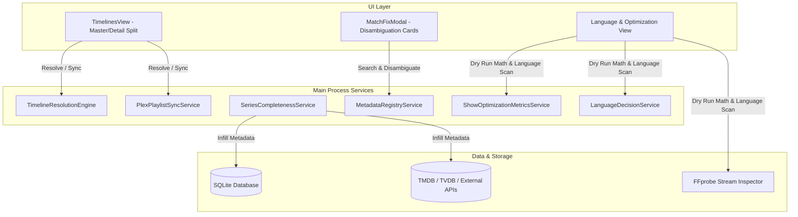

# Timelines UI, Series Disambiguation & Infill, and Real Optimization Calculations Design Spec

**Date**: 2026-08-25  
**Status**: Approved  
**Author**: Antigravity  

---

## 1. Executive Summary

This specification outlines the architecture, data structures, and UI/UX flows for 5 core enhancements across Totality:
1. **Timelines UI/UX Redesign**: Split two-column master-detail layout allowing users to select and focus on a single franchise timeline with live Plex playlist sync while retaining a quick-switching sidebar.
2. **Series Title Disambiguation**: Rich metadata comparison cards in `MatchFixModal` displaying year, network, country, status, external IDs, and full synopsis to resolve ambiguous/duplicate series matches.
3. **Series Analysis & Missing Metadata Infill**: Automatic backfilling of missing episode metadata, air dates, overviews, season art, and external IDs (TMDB/TVDB/IMDb) during series completeness analysis.
4. **Real Dry Run Optimization Engine**: True calculations based on FFprobe audio stream bitrates, track durations, and channel configurations to provide verifiable, non-mocked storage savings, scored episode counts, and track action rosters.
5. **File-Aware Audio Language Selection**: Dynamic extraction of embedded audio stream languages from local media files, presented alongside the provider-reported original language pre-selected as the authoritative default.

---

## 2. Architecture & Components

---

## 3. Detailed Specifications

### 3.1. Timelines UI/UX Redesign (`src/renderer/src/components/timelines/TimelinesView.tsx`)
- **Layout Structure**:
  - `flex flex-row h-full overflow-hidden` container.
  - **Left Pane (Master List, `w-80` to `w-96`)**:
    - Sticky header with search input filtering recipes by franchise or title.
    - Universal Importer form (Web guide URL, Trakt, AI prompt) cleanly positioned.
    - Vertical scrolling list of recipe cards showing:
      - Active item border/ring highlight.
      - Franchise badge (e.g., `Star Trek`, `Marvel MCU`, `Doctor Who`).
      - Recipe name and total item count.
      - Source badge (`Web Guide`, `Trakt`, `AI Curated`, `Curated Preset`).
  - **Right Pane (Detail View, `flex-1 overflow-y-auto`)**:
    - Focused timeline banner with title, description, external source link, and "Update from Web" action.
    - Completeness stats bar (matched vs missing count and percentage bar).
    - Plex sync control box: Select existing Plex playlist from dropdown or input custom name, with one-click safe sync.
    - Filter pills (`All`, `Matched`, `Missing`) and in-timeline text search.
    - Items table showing chronological order, item type (Movie vs TV Episode), title/season/episode, timeline era/air date, external IDs, and match status.

### 3.2. Series Title Disambiguation (`src/renderer/src/components/library/MatchFixModal.tsx`)
- **Disambiguation Indicators**:
  - Display first air year / full date in a prominent badge.
  - Display original network/distributor (e.g., BBC, Netflix, HBO) and country code.
  - Display status indicator (e.g., `Ended`, `Returning Series`).
  - Display external ID chips (TMDB ID, TVDB ID, IMDb ID) with clickable links.
  - Expandable overview/synopsis to verify series plot before applying.
  - Side-by-side selected comparison summary.

### 3.3. Series Analysis & Metadata Infill (`src/main/services/SeriesCompletenessService.ts`)
- **Auto-Infill Logic**:
  - When `series:analyze` or `series:analyzeAll` executes:
    - Check if external IDs (`tmdb_id`, `tvdb_id`, `imdb_id`) are missing in `series_completeness` or `identities`. If missing, query `MetadataRegistryService` and store authoritative external IDs.
    - Inspect local episodes: if episode title, air date, overview, or still path is null/empty in SQLite, fetch the season/episode metadata from TMDB/TVDB and update the database records.
    - Protect user overrides: never overwrite entries flagged as `user_fixed_match = 1` or manually locked in identity repository.

### 3.4. Real Dry Run Optimization Engine (`src/main/services/ShowOptimizationMetricsService.ts` & `src/main/ipc/optimization.ts`)
- **Calculated Metric Outputs (No Mocks/Cheats)**:
  - **Stream Bitrate & Size Math**:
    $$\text{Track Bytes} = \begin{cases} \text{stream.tags.NUMBER_OF_BYTES} & \text{if present} \\ \frac{\text{stream.bit_rate} \times \text{duration}}{8} & \text{if bit_rate present} \\ \text{Total File Size} \times \frac{\text{stream.channels}}{\sum \text{all channels}} \times 0.15 & \text{fallback heuristic} \end{cases}$$
  - **Recoverable Calculation**: Sum the exact byte sizes of audio tracks marked as `remove` by `LanguageDecisionService` (unwanted dubs), while keeping `retain` tracks (original language, commentary, accessibility).
  - **Show Summary**:
    - Total library file size in bytes.
    - Estimated post-cleanup size and total recoverable bytes.
    - Exact percentage savings: $(\text{Recoverable} / \text{Total}) \times 100\%$.
    - Number of scored episodes vs unscored/unparsed files.
    - Roster of candidate tracks per file with stream index, codec, language tag, channel count, and retention rationale.

### 3.5. File-Aware Language Selector & Default Handling
- **Audio Stream Inspection**:
  - Scan media files via FFprobe for embedded `audio` streams and extract unique language tags (`stream.tags.language`).
  - Map ISO-639 codes to readable names (e.g., `ja` / `jpn` $\rightarrow$ `"Japanese (jpn)"`).
- **Provider Default**:
  - Fetch original language from TMDB/TVDB metadata (e.g., `original_language: "ja"`).
  - Populate selector with available in-file languages, setting the provider's original language as the pre-selected default marked with `(Provider Default)`.

---

## 4. Verification & Testing Strategy

- **Unit & Integration Tests**:
  - Layout and state tests for `TimelinesView` master-detail selection.
  - Disambiguation metadata parsing tests in `MatchFixModal`.
  - Infill persistence unit tests verifying missing metadata fields get populated in SQLite.
  - Dry run calculation tests verifying mathematical correctness on real media stream fixtures (bitrate * duration and exact tag byte sums).
  - Language extraction and default resolution tests across various media formats.
- **Type Checking**:
  - Run `npm run typecheck` or `tsc --noEmit` across main, preload, and renderer packages.
