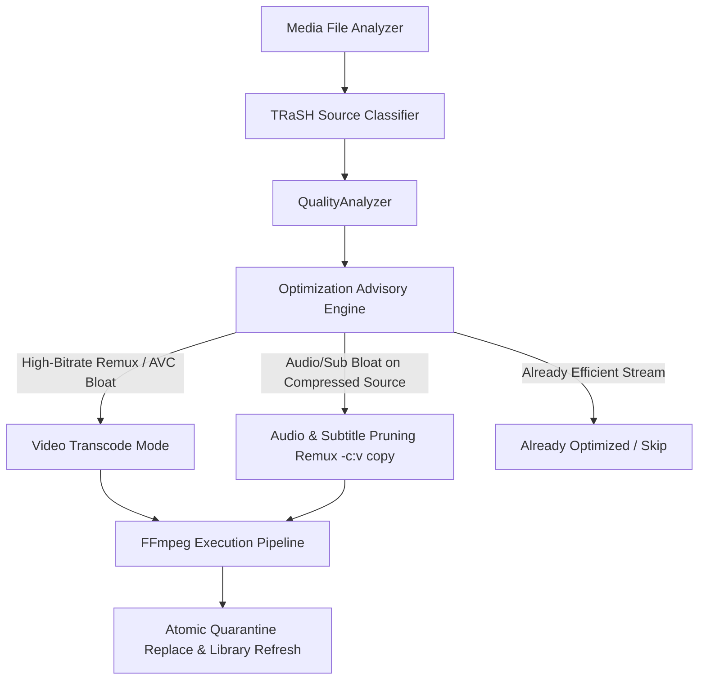

# Architecture & Design: TRaSH Guides Alignment, Smart Advisory & Lossless Stream Remuxing

## 1. Context & Motivation
Users aiming to conserve disk space face two key challenges:
1. **Unwanted File Expansion**: Transcoding already compressed sources (e.g., WEB-DLs, WEBRips, low-bitrate x264/HEVC/AV1) with Constant Quality (CQ) causes the encoder to allocate extra bits reproducing compression artifacts, resulting in output files larger than the originals.
2. **Audio & Subtitle Bloat**: Files frequently carry 2–6 GB of foreign audio dubs (5.1/7.1 European/Asian languages) and bitmap subtitle tracks that the user does not need.
3. **TRaSH Guides Standard**: TRaSH Guides (`https://trash-guides.info/`) defines the industry standard for media library scoring:
   - Never transcode WEB-DLs / WEBRips or already-efficient modern codecs.
   - Only transcode high-bitrate AVC/H.264 Remuxes ($> 12\text{ Mbps}$).
   - Prune non-original/non-preferred audio dubs and non-essential subtitle tracks using fast container remuxing (`-c:v copy`).

---

## 2. Core Architecture & Components

### 2.1 TRaSH Source & Edition Classification (`TrashSourceClassifier.ts`)
- Classify files into exact source tiers: `Remux`, `BluRay`, `WEB-DL`, `WEBRip`, `HDTV`, `SDTV`.
- Inspect filename patterns (scene tags), stream characteristics (bitrate, container, metadata tags, chapter markers), and ffprobe audio/video signatures.
- SSOT single classifier used by `QualityAnalyzer`, `TranscodingService`, and `ShowTranscodeModal`.

### 2.2 TRaSH-Aligned Quality Advisory (`QualityAnalyzer.ts`)
- **Optimization Strategy Decision**:
  - `already_optimized`: Video codec is already AV1/HEVC or source is a WEB-DL with bitrate below tier bloat threshold AND audio has no dub bloat.
  - `stream_pruning`: Video is already optimal or low-bitrate WEB-DL, but the file contains $>150\text{ MB}$ of redundant foreign audio dubs or unwanted subtitle streams. Action: `-c:v copy` remux.
  - `video_transcode`: Video is high-bitrate AVC/H.264 Remux ($> 12\text{ Mbps}$ for 1080p, $> 25\text{ Mbps}$ for 4K). Action: full GPU NVENC AV1/HEVC transcode.
- Replaces naive bitrate-only triggers with source-aware transcode recommendations to prevent accidental size inflation.

### 2.3 Lossless Stream Remuxer (`StreamRemuxCommandBuilder.ts`)
- Extends the existing `ITranscodeCommandBuilder` architecture.
- Maps video stream with zero re-encoding: `-c:v copy`.
- Maps audio streams adhering to `StreamSelectionPlan` (original language lossless/surround preserved, non-preferred dubs dropped).
- Maps subtitle streams independently using configurable global subtitle preferred languages whitelist (e.g. English, Hebrew, Spanish, etc.), independent of audio track language.
- Executes in $<2$ seconds per episode, saving hundreds of megabytes of pure container bloat without risking video quality degradation or size inflation.

### 2.4 User Override & Optimization Modes
- Users can override recommendations at any time:
  1. `smart`: Automatic TRaSH decision (Remux video transcode vs. compressed source stream pruning).
  2. `remux_only`: Forces stream copy (`-c:v copy`) with audio/subtitle cleanup even if video transcode was recommended.
  3. `transcode`: Forces full NVENC video transcode even on WEB-DL/already compressed files.
- Subtitle language whitelist configurable globally in database settings (`settings.subtitle_preferred_languages`).

### 2.5 Timeline Recipe Updates (`bundledRecipes.ts`)
- Add **Star Trek: Strange New Worlds Season 3 (10 episodes)** and **Season 4 (10 episodes)** to canonical Star Trek chronology.

---

## 3. Data Flow & Execution Sequence
1. **Preflight / Analysis**: `QualityAnalyzer` evaluates source tier, video bitrate, codec, and audio dub overhead.
2. **User Selection / Automatic Mode**:
   - `smart` (default): Executes `StreamRemuxCommandBuilder` or `NvidiaCommandBuilder` based on TRaSH advisory.
   - `remux_only`: Forces stream copy `-c:v copy` with stream hygiene.
   - `transcode`: Runs full NVENC video transcode.
3. **FFmpeg Execution**: Spawns FFmpeg, streams live progress/telemetry to UI, handles cancellation/abort immediately.
4. **Verification & Replacement**: Verifies output stream integrity, audio/subtitle track counts, and replaces original via atomic quarantine-replace.

---

## 4. Verification & Testing Strategy
- Unit tests for `TrashSourceClassifier` covering Remux, WEB-DL, WEBRip, BluRay, and HDTV parsing.
- Unit tests for `QualityAnalyzer` asserting that WEB-DLs and low-bitrate HEVC/AV1 files are marked as `stream_pruning` or `already_optimized` rather than `video_transcode`.
- Unit tests for `StreamRemuxCommandBuilder` verifying `-c:v copy` and correct stream filtering flags.
- End-to-end regression testing with `vitest run` and `tsc --noEmit`.
